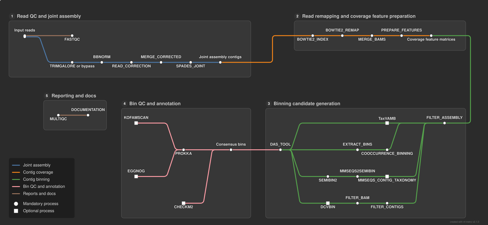

# MINIMETA Workflow

MINIMETA is the metagenomic single-cell workflow in `gongyh/nf-core-scgs`. It
combines read processing, optional per-cell read correction and joint assembly, coverage
estimation, complementary binning methods, bin consolidation, quality
assessment, and optional functional annotation.



For installation and executor configuration, see the main
[README](README.md) and [installation guide](docs/installation.md).

## Quick Start

Run MINIMETA by adding `--minimeta`:

```bash
nextflow run gongyh/nf-core-scgs \
    --minimeta \
    --reads 'data/*_R{1,2}.fastq.gz' \
    --outdir results/minimeta \
    -profile docker
```

The workflow requires Nextflow 26.04.0 or later. Substitute `docker` with an
appropriate supported execution profile, such as `singularity`, `apptainer`,
or `conda`.

To run the bundled MINIMETA test dataset from a local checkout:

```bash
nextflow run . --minimeta -profile test_minimeta,docker
```

## Inputs

MINIMETA accepts paired-end reads by default. `--reads` must be a quoted glob
with `{1,2}` marking each pair:

```bash
--reads 'reads/*_R{1,2}.fastq.gz'
```

Use `--single_end` for single-end data. Do not combine paired-end and
single-end samples in one run.

For input layouts that cannot be represented with one glob, supply
`readPaths` from a Nextflow config file:

```nextflow
params {
    readPaths = [
        ['cell_01', ['/data/cell_01_R1.fastq.gz', '/data/cell_01_R2.fastq.gz']],
        ['cell_02', ['/data/cell_02_R1.fastq.gz', '/data/cell_02_R2.fastq.gz']]
    ]
}
```

Launch with the config file using `-c samples.config`.

By default, MINIMETA normalizes reads with BBNORM and creates joint SPAdes
contigs (`--ass true`). To use preassembled metagenome contigs instead, disable
assembly and supply `--fasta`:

```bash
nextflow run gongyh/nf-core-scgs \
    --minimeta \
    --ass false \
    --reads 'data/*_R{1,2}.fastq.gz' \
    --fasta /path/to/merged.contigs.fasta \
    --outdir results/minimeta \
    -profile docker
```

The supplied FASTA replaces the joint SPAdes contigs; read correction,
merging, and joint assembly are skipped. The reads are still trimmed and
remapped to those contigs for coverage and binning. `--fasta` is required when
`--ass false` is set. When both are supplied, assembly runs and the FASTA is not
used as the MINIMETA contig input.

Boolean options accept `true` or `false` explicitly. For example,
`--run_cooccurrence_checkm false` keeps co-occurrence CheckM2 disabled.

## What The Workflow Does

1. Runs FastQC and, unless `--notrim` is set, Trim Galore.
2. By default, normalizes reads with BBNORM, corrects each sample, merges corrected reads, and performs joint SPAdes assembly.
3. With `--ass false`, imports the `--fasta` contigs instead. Remaps trimmed reads to the assembled or imported contigs.
4. Builds single-sample and multi-sample coverage features.
5. Produces bins with co-occurrence binning and SemiBin2. TaxVAMB and DCVBIN are enabled when their respective resources are provided.
6. Consolidates available bin sets with DAS Tool.
7. Runs CheckM2, Prokka, and optional KOfam and EggNOG annotation when their databases are configured.
8. Generates a MultiQC report and software-version report.

## MINIMETA Parameters

| Parameter                                 | Default     | Purpose                                                          |
| ----------------------------------------- | ----------- | ---------------------------------------------------------------- |
| `--minimeta`                              | `false`     | Select the MINIMETA workflow.                                    |
| `--ass [true\|false]`                     | `true`      | Run BBNORM normalization, correction, and joint SPAdes assembly. |
| `--fasta <path>`                          | unset       | Preassembled contigs; required with `--ass false`.               |
| `--outdir <path>`                         | `./results` | Directory for published results.                                 |
| `--notrim`                                | `false`     | Skip adapter and quality trimming.                               |
| `--saveTrimmed`                           | `false`     | Publish trimmed reads.                                           |
| `--allow_multi_align`                     | `false`     | Retain secondary and unmapped remapping alignments.              |
| `--min_length <int>`                      | `10000`     | Minimum contig length for co-occurrence binning.                 |
| `--cooccurrence_eps <number>`             | `0.05`      | Distance threshold for co-occurrence binning.                    |
| `--run_cooccurrence_checkm [true\|false]` | `false`     | Run CheckM2 on co-occurrence bins when `--checkm2_db` is set.    |
| `--checkm2_db <path>`                     | unset       | CheckM2 database for bin quality assessment.                     |
| `--mmseqs_db <path>`                      | unset       | MMseqs2 database for contig taxonomy and SemiBin2.               |
| `--metabuli_db <path>`                    | unset       | Enable the TaxVAMB integration.                                  |
| `--DNABERTS_dir <path>`                   | unset       | Enable the DCVBIN integration.                                   |
| `--kofam`                                 | `true`      | Enable KOfam annotation when both KOfam resources are supplied.  |
| `--kofam_profile <path>`                  | unset       | KOfam profile database.                                          |
| `--kofam_kolist <path>`                   | unset       | KOfam KO-list file.                                              |
| `--eggnog`                                | `true`      | Enable EggNOG annotation when `--eggnog_db` is supplied.         |
| `--eggnog_db <path>`                      | unset       | EggNOG database.                                                 |

Use `nextflow run gongyh/nf-core-scgs --minimeta --help` to display the
workflow-specific help text.

## Optional Resource Configuration

Database-dependent steps are skipped when their required resource is not
provided. A practical full-featured configuration looks like this:

```bash
nextflow run gongyh/nf-core-scgs \
    --minimeta \
    --reads 'data/*_R{1,2}.fastq.gz' \
    --checkm2_db /path/to/checkm2_db \
    --mmseqs_db /path/to/mmseqs_db \
    --metabuli_db /path/to/metabuli_db \
    --DNABERTS_dir /path/to/dnaberts_model \
    --kofam_profile /path/to/profiles \
    --kofam_kolist /path/to/ko_list \
    --eggnog_db /path/to/eggnog_db \
    -profile docker
```

The database preparation workflow can create several supported resources:

```bash
nextflow run gongyh/nf-core-scgs \
    --prepare_databases \
    --db_type checkm2,mmseqs,kofam,eggnog,metabuli \
    -profile docker
```

See [database configuration](docs/configuration/databases.md) for general
database guidance.

## Results

MINIMETA publishes its results below `--outdir`. Key directories include:

| Directory                                  | Contents                                                                  |
| ------------------------------------------ | ------------------------------------------------------------------------- |
| `fastqc/`                                  | Raw-read FastQC reports and archives.                                     |
| `trim_galore/`                             | Trimming logs, post-trimming FastQC output, and optionally trimmed reads. |
| `spades/`                                  | Per-sample correction and joint assembly results when `--ass` is set.     |
| `merged/` and `merged_bam/`                | Merged corrected reads (with `--ass`) and combined alignment files.       |
| `cooccurrence_bins/` and `extracted_bins/` | Co-occurrence clustering and extracted bins.                              |
| `semibin2_bins/`                           | SemiBin2 binning results.                                                 |
| `binning/das_tool/`                        | Consolidated bin set produced by DAS Tool.                                |
| `CheckM2/`                                 | CheckM2 quality-assessment output, when configured.                       |
| `prokka/`, `kofam/`, and `eggnog/`         | Bin annotation results when enabled.                                      |
| `MultiQC/`                                 | MultiQC report, parsed data, plots, and version information.              |
| `pipeline_info/`                           | Collated software versions.                                               |

Optional TaxVAMB and DCVBIN outputs are also published when those branches are
enabled. See the shared [output documentation](docs/output.md) for details on
FastQC and MultiQC files.
