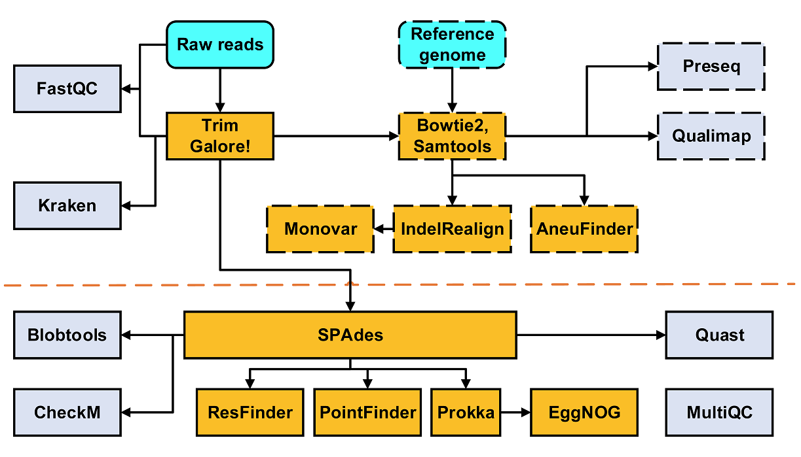

# gongyh/nf-core-scgs

**Single Cell Genome Sequencing data analysis pipeline**.

[](https://dl.circleci.com/status-badge/redirect/gh/gongyh/nf-core-scgs/tree/master)
[](https://www.nextflow.io/)
[](https://www.docker.com/)
[](https://podman.io/)
[](https://sylabs.io/docs/)
[](https://mamba.readthedocs.io/en/latest/user_guide/micromamba.html)
[](https://deepwiki.com/gongyh/nf-core-scgs)

## Introduction

The pipeline is used for single cell genome sequencing data analysis and built using [Nextflow](https://www.nextflow.io), a workflow tool to run tasks across multiple compute infrastructures in a very portable manner. It comes with docker / singularity containers making installation trivial and results highly reproducible.



## Quick start

Prerequisites: Git, Java 11 or later, Docker

```bash
## Install Nextflow
$ curl -s https://get.nextflow.io | bash
## Get the pipeline
$ git clone -b v2.0.2 https://github.com/gongyh/nf-core-scgs.git
## Test
$ export NXF_SYNTAX_PARSER=v1 # for Nextflow >= 26.04.0
$ ./nextflow run nf-core-scgs -profile test_local,docker
or $ ./nextflow run nf-core-scgs -profile test_local,podman
or $ APPTAINER_DISABLE_CACHE=true ./nextflow run nf-core-scgs -profile test_local,apptainer
or $ SINGULARITY_DISABLE_CACHE=true ./nextflow run nf-core-scgs -profile test_local,singularity
or $ ./nextflow run nf-core-scgs -profile test_local,conda
# for conda, add `disable_lockfile: true` to ~/.condarc or ~/.mambarc
```

## Documentation

The gongyh/nf-core-scgs pipeline comes with documentation about the pipeline, found in the `docs/` directory:

1. [Installation](docs/installation.md)
2. Pipeline configuration

- [Local installation](docs/configuration/local.md)
- [Adding your own system](docs/configuration/adding_your_own.md)
- [Reference genomes](docs/configuration/reference_genomes.md)

3. [Running the pipeline](docs/usage.md)
4. [Output and how to interpret the results](docs/output.md)
5. [Troubleshooting](docs/troubleshooting.md)

## Related publications

[1] Jing, X., Gong, Y., Diao, Z., et al. (2025) Phylogeny-metabolism dual-directed single-cell genomics for dissecting and mining ecosystem function by FISH-scRACS-seq. _The Innovation_ 6, 3. [https://doi.org/10.1016/j.xinn.2024.100759](https://doi.org/10.1016/j.xinn.2024.100759)

[2] Jing, X., Gong, Y., Pan, H., et al. (2022) Single-cell Raman-activated sorting and cultivation (scRACS-Culture) for assessing and mining in situ phosphate-solubilizing microbes from nature. _ISME COMMUN_. 2, 106. [https://doi.org/10.1038/s43705-022-00188-3](https://doi.org/10.1038/s43705-022-00188-3)

[3] Xu, T., Gong, Y., Su, X., et al. (2020) Phenome-Genome Profiling of Single Bacterial Cell by Raman-Activated Gravity-Driven Encapsulation and Sequencing. _Small_ 6, 30. [https://doi.org/10.1002/smll.202001172](https://doi.org/10.1002/smll.202001172)

[4] Su, X., Gong, Y., Gou, H., et al. (2020) Rational Optimization of Raman-Activated Cell Ejection and Sequencing for Bacteria. _Analytical Chemistry_ 92, 12. [https://doi.org/10.1021/acs.analchem.9b05345](https://doi.org/10.1021/acs.analchem.9b05345)

## Contact

gongyh/nf-core-scgs is developed by [Yanhai Gong](mailto:gongyh@qibebt.ac.cn), Shiqi Zhou, and [Meng Ding](mailto:15264667181@163.com). We look forward to receive your feedback, bug reports, or suggestions for the further development of this pipeline.

## [](https://opensource.org/licenses/MIT)

This pipeline is open source under the MIT license, and integrates wonderful third-party softwares, which remain owned and copyrighted by their respective developers. Authors cannot be held legally or morally responsible for any consequences that may arise from using or misusing it.
